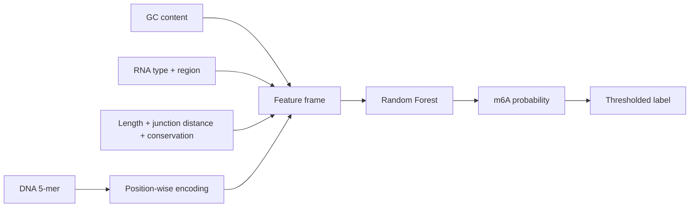
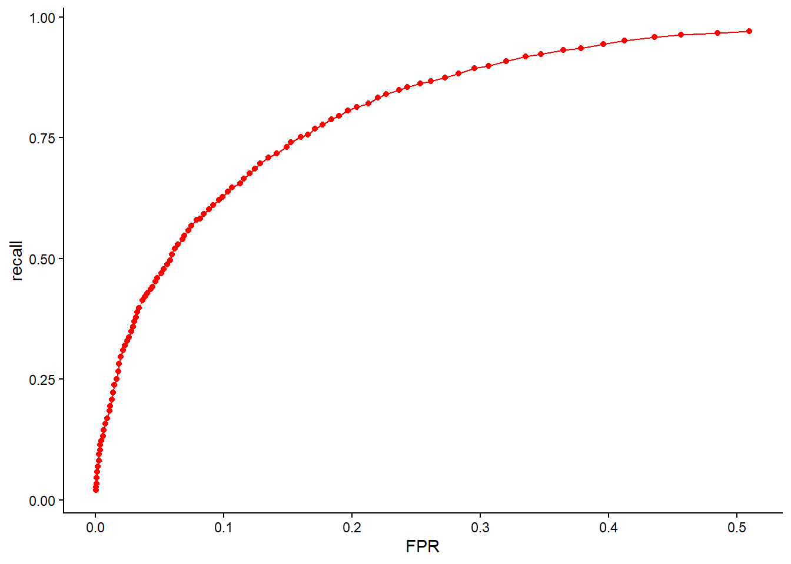
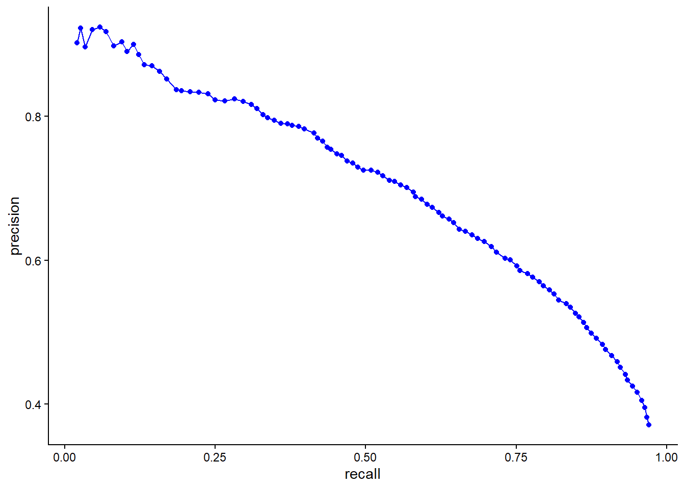

<div align="center">

# m6APrediction

**A compact R interface for sequence-aware m6A site prediction**

[](https://github.com/Ci-yo/BIO215_P3_m6APrediction/actions/workflows/repository-check.yml)


<sub>A small prediction API built around interpretable sequence and transcript-context features.</sub>

</div>

## Why this package

`m6APrediction` packages the model behind the m6A coursework workflow into three focused functions. It validates 5-mer sequences, aligns categorical feature levels with the training data and returns consistent probabilities for single or batch inference.

| Function | Role | Returns |
|---|---|---|
| `dna_encoding()` | encode one or more DNA 5-mers | five factor columns |
| `prediction_single()` | score one site and its context | probability + binary label |
| `prediction_multiple()` | score a data frame of sites | input rows + predictions |

## Install

```r
install.packages("remotes")
remotes::install_github("Ci-yo/BIO215_P3_m6APrediction")
library(m6APrediction)
```

## Quick start

```r
model_path <- system.file("extdata", "rf_fit.rds", package = "m6APrediction")
model <- readRDS(model_path)

prediction_single(
  model,
  five_mer = "ATCGA",
  gc_content = 0.60,
  RNA_type = "mRNA",
  RNA_region = "CDS",
  exon_length = 120,
  distance_to_junction = 8,
  evolutionary_conservation = 0.80
)
```

Batch mode uses the included schema-ready example:

```r
example_path <- system.file(
  "extdata", "m6A_input_example.csv",
  package = "m6APrediction"
)
sites <- read.csv(example_path, stringsAsFactors = FALSE)
predictions <- prediction_multiple(model, sites, threshold = 0.5)
head(predictions)
```

## Feature contract



Batch input requires:

```text
gc_content, RNA_type, RNA_region, exon_length,
distance_to_junction, evolutionary_conservation, DNA_5mer
```

Accepted 5-mers contain only `A`, `T`, `C` and `G`. `RNA_type` and `RNA_region` are converted to the factor levels used during training before prediction.

## Model evidence

<table>
  <tr>
    <td width="50%" align="center"><br><strong>Ranking performance</strong><br>Receiver operating characteristic.</td>
    <td width="50%" align="center"><br><strong>Positive-class performance</strong><br>Precision–recall view for an imbalanced task.</td>
  </tr>
</table>

## Repository guide

```text
BIO215_P3_m6APrediction/
├── R/                 exported prediction functions
├── man/               generated API documentation and figures
├── inst/extdata/      example input and bundled model
├── scripts/           dependency-free package archive check
└── DESCRIPTION        package metadata and dependencies
```

Run the repository-level check used in GitHub Actions:

```bash
python scripts/validate_repository.py
```

The package is licensed under MIT. Predictions are provided for education and method demonstration, not for clinical use.

> **Academic-use note**  
> This is a completed coursework portfolio project. Follow your institution's academic-integrity rules when reusing it.
