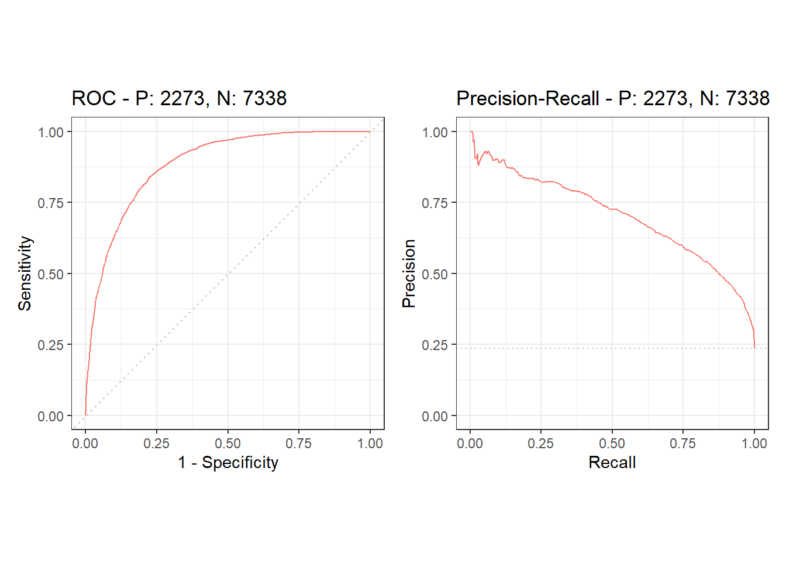

m6APrediction
================

<!-- README.Rmd — knit to produce README.md for GitHub -->

**Purpose.** Encode 5-mer DNA strings and predict N6-methyladenosine
(m6A) using a pre-trained RandomForest model.  
This package provides: (i) `dna_encoding()` to convert 5-mers into
factor features; (ii) `prediction_single()` and `prediction_multiple()`
for inference.

## Installation

``` r
# From GitHub (recommended for users)
remotes::install_github("Ci-yo/m6APrediction")
library(m6APrediction)

# For developers knitting this README **inside** the repo
if (requireNamespace("devtools", quietly = TRUE)) devtools::load_all(quiet = TRUE)
```

## Quick Start

Minimal, **runnable** examples that mirror the exported functions.

``` r
# Load example model (first try installed path; fallback to local 'inst/')
rf_path <- system.file("extdata","rf_fit.rds", package = "m6APrediction")
if (rf_path == "") rf_path <- "inst/extdata/rf_fit.rds"
rf <- readRDS(rf_path)

# Encode a 5-mer (returns a data.frame with nt_pos1..nt_pos5 factors)
dna_encoding(c("ATCGA","GGTAC"))

# Single prediction with a threshold of 0.5
prediction_single(rf, "ATCGA", 0.5)

# Batch prediction for multiple 5-mers
prediction_multiple(rf, c("ATCGA","GGGTT","TACGA"), 0.5)
```

## Model Performance

The following figures (produced in Practical 4) summarize model
performance.



- **ROC curve** with AUROC.  
- **Precision–Recall curve** with AUPRC.

## Package Structure Notes

- The trained example model is stored under `inst/extdata/rf_fit.rds`;
  users can access it via `system.file()` as shown above.
- Heavier computations should go to vignettes; keep examples here
  lightweight so they run fast.

## Citation & License

If you use this package in a report or assignment, please cite as:  
*Chen X.* (2025) **m6APrediction**: Predict m6A Sites from 5-mer DNA
Sequences.  
License: MIT. See `LICENSE` for details.

## Reproducibility

``` r
sessionInfo()
```
